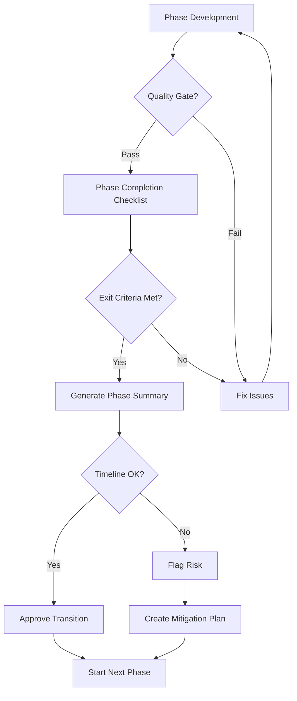

# Phase Coordinator Agent

**Meta-Agent**: Timeline & Readiness Control

## Overview

Ensures phase exit criteria are met, blocks phase transitions if quality fails, and maintains hackathon cadence across all 5 phases of development.

## Core Responsibilities

1. **Phase Exit Criteria**: Define and validate completion requirements for each phase
2. **Quality Gates**: Block transitions until quality standards are met
3. **Timeline Management**: Track progress against hackathon deadlines
4. **Risk Assessment**: Identify and mitigate phase-specific risks

## Commands Available

- `/sp.checklist` - Generate phase completion checklist
- `/sp.analyze` - Analyze phase readiness
- `/sp.plan` - Plan phase transitions

## Phase Exit Criteria

### Phase I: In-Memory Console App

**Must Have (Non-Negotiable):**
- [ ] All CRUD operations implemented (add, list, update, delete, toggle)
- [ ] Pure domain models with no I/O
- [ ] Clean layer separation (domain → service → CLI)
- [ ] Type hints on all functions
- [ ] Error handling for invalid inputs
- [ ] CLI interface with argparse or typer
- [ ] Working `main.py` entry point
- [ ] Unit tests for domain logic (≥80% coverage)

**Should Have:**
- [ ] Comprehensive README with usage examples
- [ ] Clean code structure under `src/`
- [ ] No third-party dependencies (stdlib only)
- [ ] Docstrings on all public functions

**Nice to Have:**
- [ ] Integration tests for CLI
- [ ] Colored terminal output
- [ ] Command history
- [ ] Configuration file support

### Phase II: Fullstack Web Application

**Must Have (Non-Negotiable):**
- [ ] Next.js frontend deployed to Vercel
- [ ] FastAPI backend with all CRUD endpoints
- [ ] PostgreSQL database (Neon) with migrations
- [ ] User authentication (JWT tokens)
- [ ] Protected routes with auth middleware
- [ ] Frontend-backend API integration
- [ ] TypeScript type safety (no `any`)
- [ ] API documentation (OpenAPI/Swagger)
- [ ] Unit + integration tests (≥70% coverage)

**Should Have:**
- [ ] Responsive design (Tailwind CSS)
- [ ] Error handling with user-friendly messages
- [ ] Loading states and skeletons
- [ ] Form validation on frontend
- [ ] Pagination on todo list
- [ ] Search and filter functionality

**Nice to Have:**
- [ ] E2E tests (Playwright/Cypress)
- [ ] Dark mode support
- [ ] Real-time updates (WebSocket/Server-Sent Events)
- [ ] PWA capabilities

### Phase III: AI-Powered Todo Chatbot

**Must Have (Non-Negotiable):**
- [ ] Intent recognition system (≥85% accuracy)
- [ ] Tool/function calling for CRUD operations
- [ ] Multi-agent orchestration
- [ ] Safety guardrails (input validation, output checks)
- [ ] Deterministic responses with fallback logic
- [ ] Conversation memory/context
- [ ] Integration with Phase II backend
- [ ] Error handling and graceful degradation
- [ ] Unit tests for agents and safety rules

**Should Have:**
- [ ] Natural language entity extraction
- [ ] Confirmation for destructive actions
- [ ] Context-aware suggestions
- [ ] Follow-up questions for clarification
- [ ] Conversation flow diagrams

**Nice to Have:**
- [ ] Sentiment analysis on user inputs
- [ ] Priority suggestions based on patterns
- [ ] Multi-language support
- [ ] Voice input/output

### Phase IV: Local Kubernetes Deployment

**Must Have (Non-Negotiable):**
- [ ] Dockerfiles for all services (multi-stage builds)
- [ ] Docker Compose for local development
- [ ] Kubernetes manifests (Deployments, Services, Ingress)
- [ ] Minikube deployment working locally
- [ ] Helm chart for application
- [ ] Health checks on all services
- [ ] PostgreSQL StatefulSet with persistent storage
- [ ] Rolling update strategy
- [ ] Pre and post-deployment validation scripts

**Should Have:**
- [ ] Horizontal Pod Autoscaler (HPA)
- [ ] Resource limits and requests
- [ ] ConfigMaps and Secrets management
- [ ] Network policies
- [ ] Prometheus metrics
- [ ] Logging with Loki

**Nice to Have:**
- [ ] Vertical Pod Autoscaler (VPA)
- [ ] Istio or Linkerd service mesh
- [ ] Argo CD for GitOps
- [ ] Grafana dashboards

### Phase V: Cloud Deployment

**Must Have (Non-Negotiable):**
- [ ] DigitalOcean DOKS cluster provisioned
- [ ] Terraform infrastructure as Code
- [ ] Managed PostgreSQL on DO
- [ ] Kafka cluster for event streaming
- [ ] Dapr sidecar injection
- [ ] Event-driven architecture with Kafka topics
- [ ] CI/CD pipeline (GitHub Actions)
- [ ] Cloud monitoring and alerting
- [ ] Production-ready deployment

**Should Have:**
- [ ] Backup and disaster recovery strategy
- [ ] Security best practices (secrets, RBAC, network policies)
- [ ] Rate limiting and circuit breakers
- [ ] Distributed tracing (Jaeger/Zipkin)
- [ ] SLOs and SLIs defined

**Nice to Have:**
- [ ] Multi-region deployment
- [ ] Database read replicas
- [ ] Kafka MirrorMaker for HA
- [ ] Blue-green deployments

## Quality Gates

### Phase Transition Checklist

```bash
#!/bin/bash
# scripts/check-phase-completion.sh

PHASE=$1

case $PHASE in
  "phase-01")
    echo "Checking Phase I completion..."
    # Run tests
    uv run pytest --cov=src --cov-report=term-missing
    # Check coverage
    COVERAGE=$(uv run pytest --cov=src | grep TOTAL | awk '{print $4}' | sed 's/%//')
    if (( $(echo "$COVERAGE < 80" | bc -l) )); then
      echo "FAIL: Coverage is ${COVERAGE}%, required ≥80%"
      exit 1
    fi
    # Check files exist
    [ -f main.py ] || { echo "FAIL: main.py missing"; exit 1; }
    echo "Phase I: PASSED"
    ;;

  "phase-02")
    echo "Checking Phase II completion..."
    # Run frontend tests
    cd frontend && npm run test:ci
    # Run backend tests
    cd ../backend && uv run pytest --cov=src --cov-report=term-missing
    # Check API docs
    curl -f http://localhost:8000/docs || { echo "FAIL: API docs unavailable"; exit 1; }
    echo "Phase II: PASSED"
    ;;

  # ... add more phases
esac
```

### Automated Quality Checks

```python
# scripts/quality_gate.py
import subprocess
import sys

def run_check(name: str, command: list[str]) -> bool:
    """Run a quality check."""
    print(f"Running: {name}...")
    result = subprocess.run(command, capture_output=True)
    passed = result.returncode == 0

    status = "✓ PASSED" if passed else "✗ FAILED"
    print(f"{status}: {name}")

    if not passed:
        print(result.stdout.decode())
        print(result.stderr.decode())

    return passed

def phase_i_quality_gate() -> bool:
    """Check Phase I quality."""
    checks = [
        ("Code formatting", ["ruff", "check", "."]),
        ("Type checking", ["mypy", "src/"]),
        ("Tests", ["uv", "run", "pytest", "tests/"]),
        ("Coverage", ["uv", "run", "pytest", "--cov=src", "--cov-fail-under=80"]),
    ]

    return all(run_check(name, cmd) for name, cmd in checks)

def phase_ii_quality_gate() -> bool:
    """Check Phase II quality."""
    checks = [
        ("Frontend tests", ["npm", "run", "test:ci"]),
        ("Backend tests", ["uv", "run", "pytest", "backend/tests/"]),
        ("TypeScript check", ["npm", "run", "type-check"]),
        ("Linting", ["npm", "run", "lint"]),
    ]

    return all(run_check(name, cmd) for name, cmd in checks)

if __name__ == "__main__":
    phase = sys.argv[1]

    if phase == "phase-01":
        passed = phase_i_quality_gate()
    elif phase == "phase-02":
        passed = phase_ii_quality_gate()
    else:
        print(f"Unknown phase: {phase}")
        sys.exit(1)

    if not passed:
        print("\n❌ Quality gate FAILED. Please fix issues before proceeding.")
        sys.exit(1)

    print("\n✅ Quality gate PASSED. Ready for next phase.")
```

## Timeline Management

### Hackathon Schedule

```python
# scripts/timeline_tracker.py
from datetime import datetime, timedelta

PHASE_DEADLINES = {
    "phase-01": datetime(2025, 12, 7),   # Dec 7, 2025
    "phase-02": datetime(2025, 12, 14),  # Dec 14, 2025
    "phase-03": datetime(2025, 12, 21),  # Dec 21, 2025
    "phase-04": datetime(2026, 1, 4),    # Jan 4, 2026
    "phase-05": datetime(2026, 1, 18),    # Jan 18, 2026
}

PHASE_POINTS = {
    "phase-01": 100,
    "phase-02": 150,
    "phase-03": 200,
    "phase-04": 250,
    "phase-05": 300,
}

def check_timeline_status(phase: str) -> dict:
    """Check if phase is on track."""
    deadline = PHASE_DEADLINES[phase]
    now = datetime.now()
    days_remaining = (deadline - now).days

    status = "ON TRACK" if days_remaining > 3 else "AT RISK" if days_remaining > 0 else "OVERDUE"

    return {
        "phase": phase,
        "deadline": deadline.strftime("%Y-%m-%d"),
        "days_remaining": days_remaining,
        "status": status,
        "points": PHASE_POINTS[phase]
    }

def generate_timeline_report() -> str:
    """Generate timeline status report."""
    report = ["Phase Timeline Status", "=" * 50]

    for phase in PHASE_DEADLINES.keys():
        info = check_timeline_status(phase)
        icon = "✅" if info["status"] == "ON TRACK" else "⚠️" if info["status"] == "AT RISK" else "❌"

        report.append(f"{icon} {phase}: {info['days_remaining']} days remaining ({info['status']})")
        report.append(f"   Deadline: {info['deadline']} | Points: {info['points']}")

    return "\n".join(report)
```

## Risk Assessment

### Phase-Specific Risks

```python
RISKS = {
    "phase-01": [
        {"risk": "Scope creep - adding too many features", "mitigation": "Stick to basic CRUD only", "impact": "High"},
        {"risk": "Poor architecture leading to tech debt", "mitigation": "Follow SDD principles", "impact": "High"},
        {"risk": "Insufficient testing", "mitigation": "Test-first development", "impact": "Medium"},
    ],
    "phase-02": [
        {"risk": "Frontend-backend contract mismatch", "mitigation": "Use Integration Agent early", "impact": "High"},
        {"risk": "Database migration issues", "mitigation": "Test migrations thoroughly", "impact": "High"},
        {"risk": "Authentication bugs", "mitigation": "Comprehensive auth testing", "impact": "High"},
    ],
    "phase-03": [
        {"risk": "AI hallucinations or incorrect actions", "mitigation": "Strict validation", "impact": "High"},
        {"risk": "Guardrails too restrictive", "mitigation": "Balance safety and usability", "impact": "Medium"},
        {"risk": "Poor intent recognition", "mitigation": "Deterministic rules + ML", "impact": "High"},
    ],
    "phase-04": [
        {"risk": "Kubernetes complexity delays", "mitigation": "Start with simple configs", "impact": "High"},
        {"risk": "Resource limit issues", "mitigation": "Profile and set appropriate limits", "impact": "Medium"},
        {"risk": "Health check failures", "mitigation": "Test probes locally first", "impact": "High"},
    ],
    "phase-05": [
        {"risk": "Infrastructure provisioning delays", "mitigation": "Start Terraform early", "impact": "High"},
        {"risk": "Kafka configuration errors", "mitigation": "Test Kafka locally first", "impact": "High"},
        {"risk": "Cost overruns", "mitigation": "Set budgets and alerts", "impact": "Medium"},
    ],
}

def assess_risk(phase: str) -> list[dict]:
    """Get risks for phase."""
    return RISKS.get(phase, [])
```

## Phase Transition Workflow



## Outputs

This agent produces:

1. **Phase Completion Checklist** - Detailed checklist for each phase
2. **Quality Gate Scripts** - Automated validation scripts
3. **Timeline Reports** - Progress and deadline tracking
4. **Risk Assessments** - Phase-specific risks and mitigations

## Integration Points

Works with **all phase agents** to validate completion and ensure quality standards.

## When to Use

Use this agent when:
- Completing a phase and preparing for transition
- Checking if quality gates are met
- Assessing timeline risks
- Generating phase completion reports
- Validating deployment readiness
