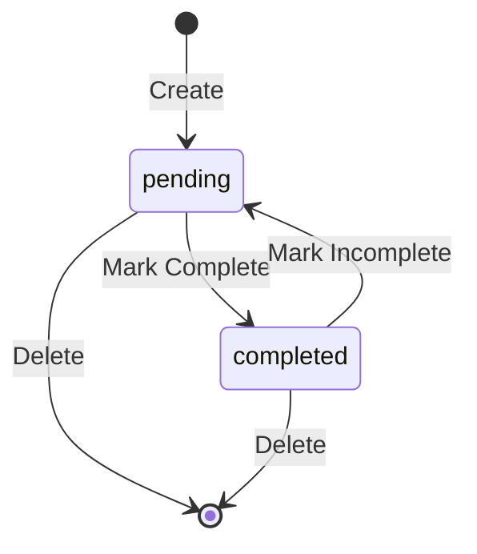

# Data Model: Frontend Task Management UI

**Feature**: 001-frontend-ui
**Date**: 2026-01-01
**Input**: Spec: `specs/001-frontend-ui/spec.md`

## Entities

### Task

Represents a single todo item.

| Field | Type | Required | Description |
|-------|------|----------|-------------|
| id | string (UUID) | Yes | Unique identifier for recursion |
| title | string | Yes | Item title (1-500 chars) |
| description | string \| null | No | Optional detailed description (max 2000 chars) |
| status | string | Yes | current status (pending \| completed) |
| priority | number | Yes | Priority level (1-5, where 1 is lowest) |
| completed | boolean | Yes | Completion flag (syncs with status) |
| created_at | string (ISO) | Yes | Creation timestamp |
| updated_at | string (ISO) \| null | No | Last update timestamp |

**Validation Rules**:
- title: 1-500 characters, whitespace trimmed
- description: Max 2000 characters
- priority: Integer between 1 and 5
- status: Must be one of prescribed values

### TaskList

Container for multiple Task entities.

| Method | Returns | Description |
|--------|---------|-------------|
| items | Task[] | List of tasks |
| add(task) | Task | Add a new task |
| update(id, updates) | Task | Update an existing task |
| remove(id) | void | Delete a task |
| filter(criteria) | Task[] | Filter tasks by status/priority |

## State Transitions

### Status Transitions



## Relationships

- TaskList contains 0..N Tasks

## TypeScript Interfaces

```typescript
export type TodoStatus = 'pending' | 'completed';

export interface Task {
  id: string;
  title: string;
  description: string | null;
  status: TodoStatus;
  priority: number;
  completed: boolean;
  createdAt: string;
  updatedAt: string | null;
}

export interface TaskCreate {
  title: string;
  description?: string;
  priority?: number;
}

export interface TaskUpdate {
  title?: string;
  description?: string;
  status?: TodoStatus;
  priority?: number;
  completed?: boolean;
}
```
